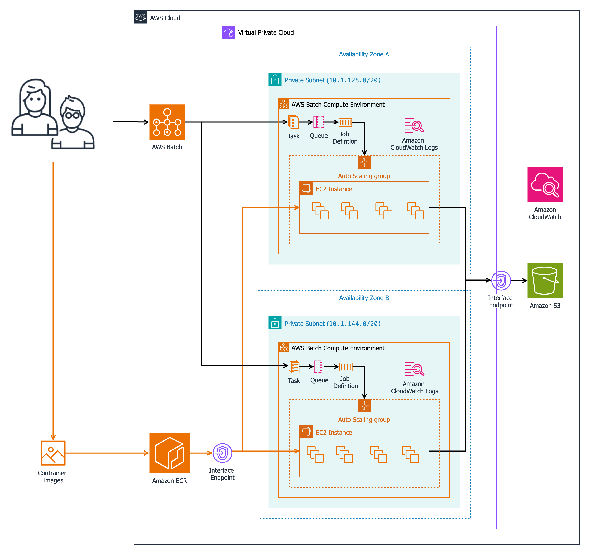

# Using AWS Batch to set up a compute cluster and deploy thousands of OpenFAST wind turbine simulations

- [Overview](#overview)
  - [Capabilities](#capabilities)
  - [Authors](#authors)
  - [Architecture diagram](#architecture-diagram)
  - [Cost](#cost)
- [Getting started](#getting-started)
  - [Operating system and third party packages](#operating-system-and-third-party-packages)
  - [AWS account requirements](#aws-account-requirements)
  - [Prerequisites](#prerequisites)
- [Build the infrastructure](#build-the-infrastructure)
  - [Local AWS configurations](#1---local-aws-configurations)
  - [Initialize submodules](#2---initialize-submodules)
  - [Apply the TurbSim patch](#3---apply-the-turbsim-patch)
  - [Build the containers](#4---build-the-containers)
  - [Retrieve the stack resource names](#6---retrieve-the-stack-resource-names)
  - [Push images to Amazon ECR](#7---push-images-to-amazon-ecr)
  - [Submit TurbSim job](#8---submit-turbsim-job)
  - [Submit OpenFAST job](#9---submit-openfast-job)
- [Cleanup](#cleanup)

# Overview

This sample code deploys an [AWS Batch](https://aws.amazon.com/batch/) compute cluster to run thousands of [OpenFAST](https://github.com/OpenFAST/openfast) simulations on AWS. 
However, this sample code can be adapted to run any batch workload on AWS requiring pre-processing, simulations, and post-processing steps. 

OpenFAST is a physics-based, open-source wind turbine global performance simulation application for designing wind turbines in accordance with IEC 61400-1 (onshore wind turbines) and IEC 61400-3 (offshore wind turbine) standards. 
OpenFAST is containerized using Docker and simulations are run in a private subnet isolated from the internet.
The only access points to the simulation are through VPC endpoints with [AWS PrivateLink](https://aws.amazon.com/privatelink/). 
This guidance uses the [AWS Cloud Development Kit (AWS CDK)](https://aws.amazon.com/cdk/) to deploy infrastructure assets. 

## Capabilities

This sample code helps you: 

* Deploy AWS resources using AWS CDK
* Create thousands of turbulence input files for OpenFAST using [TurbSim](https://github.com/old-NWTC/TurbSim)
* Run thousands of [OpenFAST](https://github.com/OpenFAST/openfast) simulations
* We provide [TurbSim simulation](./pkg/turbsim/input/simulation-definition.json) and [OpenFAST simulation](./pkg/openfast/simulation-definition/) definitions to auto-generate hundreds of simulation input files as a starting point

Two OpenFAST definition sheets sheets are provided to run [DLC 1.2](./pkg/openfast/simulation-definition/simulation-definition-DLC12-NTM.json) and [DLC 1.3](./pkg/openfast/simulation-definition/simulation-definition-DLC13-ETM.json) as part of this sample code. 
These definition files run wind turbine simulation cases defined in IEC 61400-1. 

## Authors

This project is built and maintained by [Marco Masciola](https://www.linkedin.com/in/marcomasciola/) and [Guyu Ye](https://www.linkedin.com/in/guyu-ye/).


## Architecture diagram



## Cost

This is the estimated cost for running this sample code in `us-west-2` region. 
This assumes 264 TurbSim input files are generated and 264 OpenFAST simulations are evaluated:

| AWS service  | Cost [USD] |
| ----------- | ------------ |
| Amazon EC2 | <$9 |
| Amazon Virtual Private Cloud | < $1 |
| Amazon ECR | < $1 |
| Amazon ECS | < $1 |
| Amazon S3 | < $1 |
| Amazon CloudWatch | < $1 |

Be sure to destroy the infrastructure as descirbed in the [cleanup](#cleanup) section to avoid costs when you are done evaluating this sample code. 

# Getting started

This Guidance uses AWS CDK. 
If you are unfamiliar with CDK or using it for the first time, you can refer to the [Getting started with AWS CDK](https://docs.aws.amazon.com/cdk/v2/guide/getting_started.html) guide. 

## Operating system and third party packages

The instructions in this guidance are verified to run on OSx and Linux operating systems. 
The following packages will need to be installed on your environment to deploy and run sample code provided in this guidance: 

* [Node.js](https://nodejs.org/en/learn/getting-started/how-to-install-nodejs) (tested on version `v23.6.1`) 
* [TypeScript](https://www.npmjs.com/package/typescript) (tested on version `5.6.3`)
* [AWS Cloud Development Kit (CDK)](https://aws.amazon.com/cdk/) (tested on version `2.1002.0 build 09ef5a0`)
* [jq](https://jqlang.github.io/jq/download/) command line JSON parser to retrieve AWS services names (tested using version `1.7.1`)
* A container development client, such as Docker or [Finch](https://github.com/runfinch/finch) 
* This project relies on OpenFAST v4.0.0 (commit ID `da685d49`) and TurbSim (commit ID `873c7a70`)

## AWS account requirements

IAM Identity must be assigned with permissions to deploy the stack using AWS CDK. 
This infrastructure can be deployed and run with the following IAM policies: 

* `AWSCloudFormationFullAccess`
* An inline policy with fine granular permissions defined in [`sample-iam-policy.json`](./assets/sample-iam-policy.json)

Additional IAM permissions are needed to use the resources deployed in this CDK sample code. Consult with your security team or AWS account administrator to provide IAM identity access to the following resources: 

* Amazon S3
* AWS Batch

## Prerequisites

This section provides the steps required to configure your environment before deploying the infrastructure using AWS CDK. 
These steps include: 

1. Cloning the repository for this guidance
2. Installing node dependencies

#### 1 - Clone the repository

If using HTTPS:

```bash
git clone https://github.com/aws-samples/sample-deploy-openfast-compute-cluster-on-aws-batch.git
```

If using SSH: 
```bash
git clone git@github.com:aws-samples/sample-deploy-openfast-compute-cluster-on-aws-batch.git
```

#### 2 - Install CDK

Install AWS CDK by running the following command: 

```bash
npm i aws-cdk
npm i cdk-nag
cdk --version || npm install -g aws-cdk
```

# Build the infrastructure

There are seven steps to deploy the sample code guidance in your AWS account:

1. Local AWS configurations
2. Initialize OpenFAST and TurbSim submodules
3. Apply TurbSim patch 
4. Build the OpenFAST and TurbSim containers
5. Bootstrap CDK and deploy the infrastructure
6. Retrieve the stack resource names using [resource.sh](./resource.sh)
7. Push the containers to [Amazon Elastic Container Registry (ECR)](https://aws.amazon.com/ecr/)
8. Submit the TurbSim batch array jobs and wait for them to complete
9. Submit the OpenFAST batch array jobs and wait for them to complete

#### 1 - Local AWS configurations

Before deploying the AWS infrastructure, you will need to set up environment variables. 
The first step is to set your AWS profile for the IAM user defined in `~/.aws/credentials` with permissions to deploy the infrastructure. 
You can do this by running: 

```bash
export AWS_PROFILE=<profile-name>
```

where `<profile-name>` is the profile name defined in `~/.aws/credentials`.
Next, set the account ID, region, and project name environment variables with: 

```bash
export AWS_ACCOUNT_ID=$(aws sts get-caller-identity --query Account --output text)
export AWS_REGION=$(aws configure get region)
export PROJECT_UUID=$(uuidgen | tr A-Z a-z | cut -c1-16) 
```

The environment variable `PROJECT_UUID` assign a unique name and identify for the deployed infrastructure assets.
The `PROJECT_UUID` must be unique for each deployed stack to ensure Amazon S3 buckets have unique names. 
These next commands replaces the `null` context parameter in [`cdk.json`](./cdk.json) with the `PROJECT_UUID` defined above:

```bash
jq --arg uuid $PROJECT_UUID '.context.dev.uuid=$ARGS.named.uuid' cdk.json > tmp && mv tmp cdk.json
```

#### 2 - Initialize submodules

```bash
git submodule update --init --recursive
```

#### 3 - Apply the TurbSim patch

```bash
cd ./pkg/turbsim/TurbSim
cp ../873c7a70.patch .
git apply --stat 873c7a70.patch
git apply --check 873c7a70.patch
git apply 873c7a70.patch
rm 873c7a70.patch
```

#### 4 - Build the containers

This project requires you to build two containers to execute TurbSim and OpenFAST on AWS Batch. 

##### 4.a - Build OpenFAST

Type the following commands to build OpenFAST: 

```bash
aws ecr-public get-login-password --region us-east-1| docker login --username AWS --password-stdin public.ecr.aws
cd ../../openfast/
docker build --no-cache -t openfast .
```

This task will take approximately 1 hour to complete. 

##### 4.b - Build TurbSim

You can build TurbSim by running the command: 

```bash
aws ecr-public get-login-password --region us-east-1| docker login --username AWS --password-stdin public.ecr.aws
cd ../turbsim
docker build --no-cache -t turbsim .
```

This task will take a few minutes to complete. 

#### 5 - Deploy the infrastructure

If you are deploying this infrastructure for the first time, ensure you are bootstrapping the environment. 
Bootstrapping is a one-time action to provision resources for deploying infrastructure.
The infrastructure can be deployed with the following command: 

```bash
cd ../../
cdk bootstrap -c env="dev"
cdk synth -c env="dev"    
cdk deploy --all --require-approval never -c env="dev"    
```

We are deploying infrastructure to a development environment in the above example, but you can also assign `env="prod"` to deploy in a prodction sandbox by defining a new `dev` context key in [cdk.json](./cdk.json). 

#### 6 - Retrieve the stack resource names

Resource names are output during the `cdk deploy` step.
But you can retrieve resource names by running this command:

```bash
source resource.sh
```

This command will output the deployed resources names:

* `S3_ASSET_BUCKET_NAME`
* `S3_LOG_BUCKET_NAME`
* `TURBSIM_REGISTRY`
* `OPENFAST_REGISTRY`
* `OPENFAST_JOB_DEFINITION`
* `TURBSIM_JOB_DEFINITION`
* `JOB_QUEUE`

These resource ID's are needed in subsequent steps to push containers to ECR and dispatch batch array jobs. 

#### 7 - Push images to Amazon ECR

The next step is to push the OpenFAST and TurbSim containers to ECR. 
This command pushes the TurbSim image to the `TURBSIM_REGISTRY` in ECR: 

```bash
aws ecr get-login-password --region $AWS_REGION | docker login --username AWS --password-stdin $AWS_ACCOUNT_ID.dkr.ecr.$AWS_REGION.amazonaws.com
docker tag turbsim:latest $AWS_ACCOUNT_ID.dkr.ecr.$AWS_REGION.amazonaws.com/"$TURBSIM_REGISTRY":latest
docker push $AWS_ACCOUNT_ID.dkr.ecr.$AWS_REGION.amazonaws.com/"$TURBSIM_REGISTRY":latest
```

A similar command is run to push the OpenFAST container, this time substituting the `OPENFAST_REGISTRY` resource name from step 3 into the image tag name: 

```bash
docker tag openfast:latest $AWS_ACCOUNT_ID.dkr.ecr.$AWS_REGION.amazonaws.com/"$OPENFAST_REGISTRY":latest
docker push $AWS_ACCOUNT_ID.dkr.ecr.$AWS_REGION.amazonaws.com/"$OPENFAST_REGISTRY":latest
```

#### 8 - Submit TurbSim job

Refer to the [TurbSim README](./pkg/turbsim/README.md) on how to customize the JSON file to evaluate different turbulence conditions. 
Create a JSON file named `turbsim-job.json` by pasting the following contents in your terminal: 

```bash
cat <<EOF > ./turbsim-job.json
{
    "jobName": "ntm-b-turbsim-job",
    "jobQueue": "$JOB_QUEUE",
    "arrayProperties": {
        "size": 266
    },
    "containerOverrides": {
        "environment": [
            {
                "name": "IEC_TURB",
                "value": "B"
            },
            {
                "name": "IEC_WIND_TYPE",
                "value": "NTM"
            },
            {
                "name": "S3_BUCKET",
                "value": "$S3_ASSET_BUCKET_NAME"
            }
        ]
    },
    "jobDefinition": "$TURBSIM_JOB_DEFINITION",
    "timeout": {
        "attemptDurationSeconds": 1800
    }
}
EOF
```

Next, submit the batch job by typing: 

```bash
aws batch submit-job --cli-input-json file://turbsim-job.json
```

This command will output information similar to this in the terminal: 

```json
{
    "jobArn": "arn:aws:batch:<AWS_REGION>:<AWS_ACCOUNT_ID>>:job/19e3526f-122d-421d-bb95-f9e2585b8085",
    "jobName": "ntm-b-turbsim-job",
    "jobId": "19e3526f-122d-421d-bb95-f9e2585b8085"
}
```

The `jobId` field is a unique hash ID attached with the job you just submitted. 
You can check the status of the job by running in the command line: 

```bash
aws batch describe-jobs --jobs "<job-id>"
```

where the `<job-id>` is the `jobId` field for the submitted batch job. 
You can shortcut the above step to output only the job status by running: 

```bash
aws batch describe-jobs --jobs "<job-id>" | jq -r '.jobs[0].arrayProperties'
```

It will take a few minutes for the 266 jobs above to move from the `RUNNABLE` to `RUNNING` state. 
We also use Amazon CloudWatch logs to monitor the activity of in the batch jobs. 
This command will output the status of job that emit an `ERROR` code: 

```bash
export LOG_GROUP=openfast-$PROJECT_UUID
aws logs filter-log-events --log-group-name /$LOG_GROUP/turbsim --filter-pattern "ERROR"
```

CloudWatch will log events for failed simulations. 
The above command filters events based on `ERROR` tags emitted in the simulation with an error code. 
Higher resolution information from the failed job can be output using the following command: 

```bash
aws logs get-log-events --log-group-name /$LOG_GROUP/turbsim --log-stream-name <log-stream-name> --output text
```

where `<log-stream-name>` is the `LogStreamName` from a single failed event output from the `filter-log-events` command. 
TurbSim simulation will be output to the S3 assets bucket `S3_ASSET_BUCKET_NAME` using this path directory scheme: 

```bash
s3://<S3_BUCKET>/turbsim/<IEC_WIND_TYPE>/<IEC_TURB>/
```

In the case of the TurbSim job submitted through the `turbsim-job.json` file, the results path is: 

```bash
s3://asset-openfast-<uuid>/turbsim/NTM/B/
```

Failed TurbSim input and summary files will be uploaded to the `_failed` directory in the path above. 
Advanced to the next step after 264 jobs are in the `SUCCEEDED` state. 

**NOTE:** Two TurbSim simulations will fail in this demo. This is intentional to demonstrate CloudWatch logging capability to extract failed simulation information.

#### 9 - Submit OpenFAST job

We follow a similar process to run OpenFAST simulations. 
Refer to the [OpenFAST README](./pkg/openfast/README.md) for JSON file customizations to evaluate different load cases. 
Create a JSON file named `openfast-job.json` by running the following command:

```bash
cat <<EOF > ./openfast-job.json
{
    "jobName": "dlc12-ntm-openfast",
    "jobQueue": "$JOB_QUEUE",
    "arrayProperties": {
        "size": 264
    },
     "containerOverrides": {
        "environment": [
            {
                "name": "IEC_TURB",
                "value": "B"
            },
            {
                "name": "WIND_CLASS",
                "value": ""
            },
            {
                "name": "S3_BUCKET",
                "value": "$S3_ASSET_BUCKET_NAME"
            },
            {
                "name": "SIMULATION_DEFINITION",
                "value": "./simulation-definition/simulation-definition-DLC12-NTM.json"
            },
            {
                "name": "CASE_ID",
                "value": "test-case"
            }
        ]
    },
    "jobDefinition": "$OPENFAST_JOB_DEFINITION",
    "timeout": {
        "attemptDurationSeconds": 1600
    }
}
EOF
```

and submit the batch job by running:

```bash
aws batch submit-job --cli-input-json file://openfast-job.json
```

You can use a similar series of command to monitor simulation status, compute cluster state, or error status using the following commands: 

```bash
aws batch describe-jobs --jobs "<job-id>" | jq -r '.jobs[0].arrayProperties'
aws logs filter-log-events --log-group-name /$LOG_GROUP/openfast --filter-pattern "ERROR"
aws logs get-log-events --log-group-name /$LOG_GROUP/openfast --log-stream-name <log-stream-name> --output text
```

The difference in the above command is the log group name. 
We use the `openfast` suffix in the log group name for OpenFAST simulations. 
Grouping log in the form simplifies filtering. 
All simulation result files are uploaded to the S3 assets bucket path:

```bash
s3://<S3_BUCKET>/turbsim/<IEC_WIND_TYPE>/<IEC_TURB>/
```

In the case of the TurbSim job submitted through the `turbsim-job.json` file, the results path is: 

```bash
s3://asset-openfast-<uuid>/simulation/<CASE_ID>/dlc=<load-case>/
```

where `<CASE_ID>` is defined in `openfast-job.json` job file and `<load-case>` is defined by the simulation definition sheet load case tag. 
Failed TurbSim input and summary files will be uploaded to the `_failed` directory in the path above and grouped by wind speed. 

# Cleanup

The infrastructure is destroyed using the following command:

```bash
cdk destroy --all -c env="dev" 
```

This CDK stack is configured to retain the S3 log and asset buckets. 
You must manually delete both buckets to destroy these resources. 
This can be done by running: 

```bash
aws s3 rm $S3_ASSET_BUCKET_NAME --recursive  
aws s3 rb $S3_ASSET_BUCKET_NAME 
aws s3 rm $S3_LOG_BUCKET_NAME --recursive  
aws s3 rb $S3_LOG_BUCKET_NAME 
```